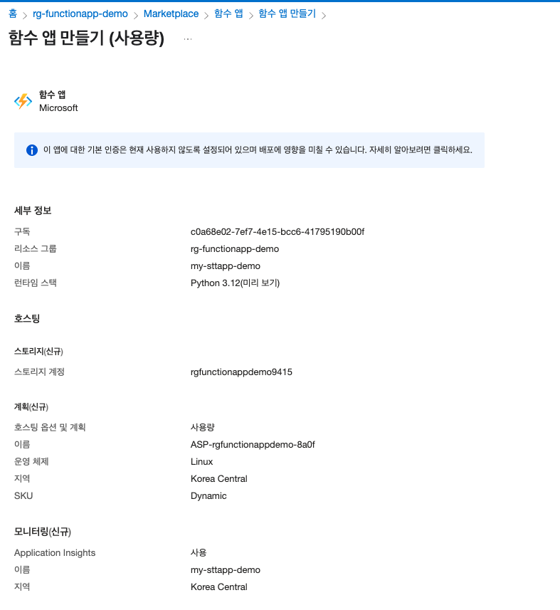
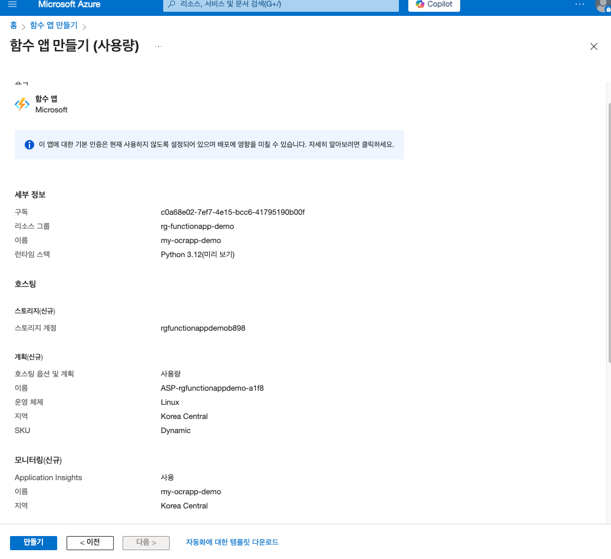

# Azure Function

# 참고 사이트

1. Udemy 강의
    1.  https://www.udemy.com/course/best-azure-serverless/learn/lecture/29316804?start=0#overview: Azure Functions 및 Logic Apps을 통한 서버리스 컴퓨팅

1. Github
    1.  https://github.com/angie4u/AzureFunctions: Blob storage에 이미지 업로드 시 function 실행, local에서도 라이브러리를 설치하여 실행해볼 수 있음
2. 티스토리
    1.  https://nanenchanga.tistory.com/entry/Azure-Functions-2-Azure-Potal-%EC%97%90%EC%84%9C-%ED%95%A8%EC%88%98-%EC%83%9D%EC%84%B1

## 강의 내용

1. 함수 트리거
    1. HTTP, Timed events, Github, Blog
2. 웹앱 등 개발 가능

# 1. 리소스 생성

- my-sttapp-demo

- my-ocrapp-demo

# 2. Blob Storage 생성

my-sttapp-demo에 연동된 Storage에서 audio-storage 컨테이너 생성

해당 컨테이너에 .mp3 파일 업로드 (.wav 형식 권장)

파일 업로드 시 권한 수정 필요 

# 3. 함수 생성

### Azure Portal

.png)

my-sttapp-demo 내 Azure Portal에서 만들기 선택

### 트리거

.png)

다양한 트리거가 있습니다. → Blob trigger 선택

### 템플릿 정보

함수 이름: transcribeAudio

Path: 생성한 컨테이너 내 Blob Storage의 경로

Storage account connection: my-sttapp-demo 생성 시 매핑되는 기본 Storage

.png)
