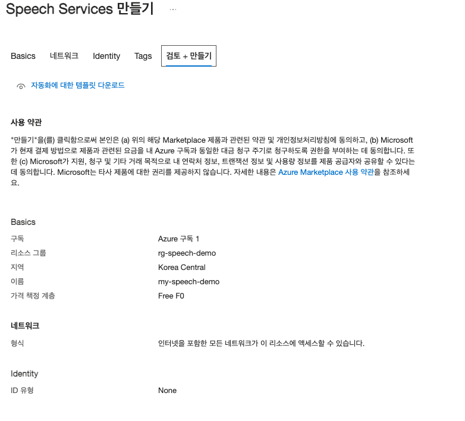

# Azure Speech to Text

# 참고 사이트

### 티스토리

- 기본 설정

https://mj-thump-thump-story.tistory.com/entry/STT-Azure-STT-%EC%82%AC%EC%9A%A9%EB%B2%95

- 소스 코드
    - 기본 마이크를 오디오 입력으로 사용합니다.
    - REST API와 SDK를 통해 사용합니다.

https://sosodev.tistory.com/entry/AI-Microsoft-Azure-Speech-Services-%EC%82%AC%EC%9A%A9-%EB%B0%A9%EB%B2%95

### Azure AI Services

https://portal.azure.com/#view/Microsoft_Azure_ProjectOxford/CognitiveServicesHub/~/overview

# 1. 리소스 생성

- 아래 링크에서 STT(Speech to text) 리소스 생성

https://portal.azure.com/#create/Microsoft.CognitiveServicesSpeechServices

- F0로 만들었습니다.



# 2. SDK 방식으로 로컬에서 실행

### 패키지 설치

pip install azure-cognitiveservices-speech

pip install dotenv

# 3. 결과

2025.04.14(월) 3명의 대화 내용을 gpt-4o 모델을 사용해서 회의록 작성을 요청

```bash
회의 내용이야. 요약해 주고 Action item을 뽑아 줄래?

안녕하세요, 안녕하세요.
그 저희 실제로 회의하듯이 한번 해볼까요?
어 이게 인식이 꽤 잘 돼가지고.
우리 앞으로 검증 단계에서 해야 될 일을 한번 정리를 해볼까요? 네, 그러면.
그 지금 스피치 투 텍스트랑 다큐먼트, 인텔리전스까지는 개발이 완료됐고 이걸 블로 스토리지 안에 넣어서 어 AI 서치랑 오픈 AI 서비스 사용하고 매일 발송하는 게 로직 앱스 내에서 잘 작동이 되는지 이 부분을 테스트를 해봐야 될 것 같습니다.
그렇게까지 한 게 1번째 스프린트 범위였었죠. 아 1번째 스프린트는 그 OCR 기능 제외하고 스피치 투 텍스트 기능까지였고 이제 2번째 스프린트에서 OCR 기능까지 추가한 범위입니다.
근데 지금 우리 검증 단계인데 진도가 벌써 안 한 거란 거예요 뭐?
하나 하나 서비스들을 서비스들이 잘 작동하는지 성능을 먼저 파악해야 되니까요 이제.
뭐 나머지들도 다 하나하나 검증한 다음에 연동할 때 좀 시간이 걸릴 것 같습니다.
단위 테스트 느낌으로.
지금 지연이가 개발한 부분이 1번째 로 단위 테스트 하나가 됐다라고 보고 이제 또 다른 단위 테스트 느낌으로 어 AI 셔츠랑 이런 거 블록 스토리지는 가져와서.
요약이 되는지?
네, 그런 식으로.
검증단계에서 확인을 하면 되는거겠죠? 네, 그럼 될 것 같습니다.
그 다큐먼트 인텔리전스도 보여드릴게요.
어차피 돌아가고 있으니까.
이거는?
이거는 그 저희 아키텍처 그렸었잖아요. 그 이미지들을 여기 안에 넣고.
이거를 텍스트를 얼마나 잘 전사하는지 그거를 확인을 해봤는데요. 이렇게 네 장의 이미지를 사용을 했고 이것도 똑같이 환경변수 안에 설정을 해준 다음에 그 리소스는 레저에서 따로 만들어졌었어요. 그래서 어 뭐 코드도 간단한데 이제 여기 폴더 안에 있는 이 포맷으로 된 파일들이 있으면 안에 있는 걸 다 이미지 처리를 해주는 거예요.
그래서 이게 출력된 값입니다.
그때 그 걱정했던 부분처럼.
이 아키텍처가 있으면 그냥 텍스트를 뽑아올 뿐이지 이게 어떤 건지 구조화돼서 나오지는 않아요.
그래서.
어, 그래도 이게 아키텍처 내에 어떤 텍스트가 있으면 좀 더 회의록을 작성을 할 때 도움은 될 거니까 이게 좀 의미가 있지 않을까 했고.
또 그 2번째 이미지 같은 경우에는 이게 다 텍스트로만 되어 있는 페이지다 보니까 이걸 정확하게 좀 인식이 되는 것을 확인을 할 수 있었습니다.
이제 궁금한 게 회의록에 이미지가 이제 화면 공유될 때 그거를 텍스트로 할 필요가 있을까요? 텍스트화 할 필요가 있을까요? 그 그림 그대로 넣고 그 회의에서 말하는 사람의 텍스트만 받아오면 되지 않을까 싶어서 그림을 그림 그대로 이미지 그대로 들어가는 게 더 좋지 않을까요?
어, 그런데 회의할 때 이미지가 굉장히 많잖아요. PPT 가 한 30장 있으면 이거를 계속 넘기면서 설명을 할 텐데 이걸 요약을 해서 회의록에 이제 누군가는 저희가 회의록을 작성한다고 할 때 그 피피티에 있는 내용을 좀 요약을 해서 작성을 한다거나 실제론 그렇게 진행을 하잖아요. 그래서 그걸 추출을 해서 낫지 않을까 했어요. 화면 공유해서 말하시는 분이.
아마 요약을 해서 넘어갈 거기 때문에 그 요약된 말만.
텍스트하고 이 이미지는 그대로 들어가는 게 저는 좋지 않을까 하는 생각이 드는데?
음 아 요지를 또 요약할 필요는 없다고 하시는 거죠? 어차피 발표자가 요약해서 요약해서 이렇게 핵심 내용은 언급을 할 것 같아서.
그래서 저도 그때 저번에도 얘기했듯이 이게 어떤 이미지를 회의록에 넣을지 그런 거에 대해서 뭔가 좀 사용자 입력을 받아서 변 좋을 것 같다고 생각하긴 했어요. 이게 사람마다 다를 수 있잖아요. 지연이 같이 이런 것도 요약해 주길 원할 수도 있고 과장님처럼 그게 불필요한 사람도 있으니까.
그런 것도 한번 여기 설계 아키텍처 상해 조금 녹여야 되나?
어 음 이거는 음.
키득통 그니까 다른 분들 의견도 들어보고 우차장님이나 팀장님한테 한번 여쭤보고 하면 좋을 것 같아요.
여기까지만 해도 이제 화 확인해 볼까요, 해볼까?
```

# 4. 회의록 작성 요청
- stt 기능 검증을 위해 gpt-4o 모델 사용하여 회의록 작성
- azure stt 내 화자 구분이 되지 않는 상황에서도 회의록의 정확도 확인

## 📝 회의 요약

1. **현재 개발 진행 현황**
    - **Speech-to-Text**와 **Document Intelligence** 개발 완료됨.
    - 해당 결과를 **Blob Storage**에 저장하고, **Azure AI Search** 및 **OpenAI 서비스**와 연동해 **Logic Apps로 자동 발송하는 기능** 테스트 예정.
2. **스프린트 진행 상황**
    - 1차 스프린트: **STT 기능 중심** (OCR 제외)
    - 2차 스프린트: **OCR 기능 포함**
3. **검증 단계의 방향**
    - 각 서비스를 **단위 테스트 수준으로 개별 검증** 후, 연동 테스트 진행 예정.
    - 현재 **지연**이 개발한 STT는 단위 테스트 완료로 간주.
    - 이후에는 Blob Storage 내의 텍스트로 AI Search 및 요약 가능 여부 확인 필요.
4. **Document Intelligence 검증 결과**
    - 이미지 4장을 OCR 처리함.
    - 이미지 내 텍스트는 **비구조화된 채로 추출됨** (단순 텍스트)
    - 특히 텍스트 위주의 이미지는 **정확하게 인식**됨을 확인.
5. **회의록 이미지 처리 방향 논의**
    - *공유된 이미지(PPT)**의 내용을 텍스트로 추출할 필요가 있는지에 대한 논의 발생.
        - 일부는 발표자의 설명만 텍스트로 기록하고, 이미지는 **그대로 삽입**하는 것을 선호.
        - 반면, 누군가는 **이미지 내 텍스트도 요약해서 기록**하길 원함.
    - 따라서 **사용자 옵션/설정**을 통해 선택 가능하게 하는 방안이 제안됨.
    - 최종 방향은 **우차장님 및 팀장님 의견 반영 예정**

---

## ✅ Action Items

| 항목 | 담당 | 내용 |
| --- | --- | --- |
| 1 | 전체 팀 | **STT + OCR 결과**를 Blob Storage에 저장 후 Logic Apps와 연동해 **자동 발송 테스트** 진행 |
| 2 | 지연 | **STT 단위 테스트 완료**로 보고, 다음 테스트 설계로 이동 |
| 3 | TBD | **Blob Storage → AI Search → 요약 기능**이 정상 작동하는지 검증 |
| 4 | TBD | **Document Intelligence 결과 구조화 가능성** 추가 검토 |
| 5 | TBD | 회의 이미지 처리 방향(요약 or 그대로 삽입)에 대해 **사용자 옵션 설계 고려** |
| 6 | 누구든 | **우차장/팀장**에게 이미지 처리 방향에 대한 피드백 요청 |

```bash
이 회의록은 3명이 대화한 내용인데, 혹시 화자도 구분해서 요약할 수 있을까?
```

## 🔍 화자 구분 가능 여부

| 조건 | 구분 가능 여부 |
| --- | --- |
| 음성 파일 + Azure STT(Speaker Diarization 지원) | ✅ 정확한 화자 구분 가능 |
| 텍스트만, 화자 미표기 상태 | ⚠️ 말투/내용 기반 추론은 가능하나 완전한 정확도는 없음 |

---

## 🔧 추론 기반 화자 구분 예시 요약

> 아래는 회의 내용을 3명의 화자로 나눠 추론해 본 버전입니다. (지연 님 = 개발자, 과장님 = 관리자 스타일, 화자A = 질문/조율)
> 

---

### 🧑‍💻 **지연 (개발자)**

- Speech-to-Text, Document Intelligence 개발 완료
- Logic Apps 자동화 테스트 남음
- 이미지 기반 OCR은 텍스트만 추출됨 (구조화 불가)
- 이미지 4장을 OCR 테스트했고, 텍스트 기반 이미지는 잘 인식됨
- OCR 코드에 대해 간단 설명 (환경변수, 폴더, 포맷, 결과 확인)

---

### 👨‍💼 **과장님 (실무 관리자)**

- "회의록에 굳이 이미지 텍스트를 추출해서 넣어야 하나?"
- "발표자가 말한 요약 텍스트만 있으면 되지 않을까?"
- "이미지는 이미지 그대로 회의록에 삽입하는 것이 낫다"
- “요약은 어차피 사람이 할 거라 핵심만 말로 나올 것”

---

### 👩‍💬 **화자 A (기획 또는 리드)**

- "지금 검증 단계에서 해야 할 일 정리해보자"
- "단위 테스트 식으로 하나씩 성능 검증하자"
- "사람마다 이미지 처리에 대한 생각이 다를 수 있다"
- "결정 전에 팀장님, 우차장님 의견 받아보자"

---

## ✅ 화자 기반 Action Items (추론 기반)

| 화자 | Action Item |
| --- | --- |
| 지연 | STT + OCR 연동 테스트, Document Intelligence 코드 정리 |
| 과장님 | 회의록에 이미지 요약 불필요 의견 제시 |
| 화자A | 사용자 선택 기반 이미지 요약 옵션 설계 고려, 최종 결정은 팀장/우차장 논의 후 |